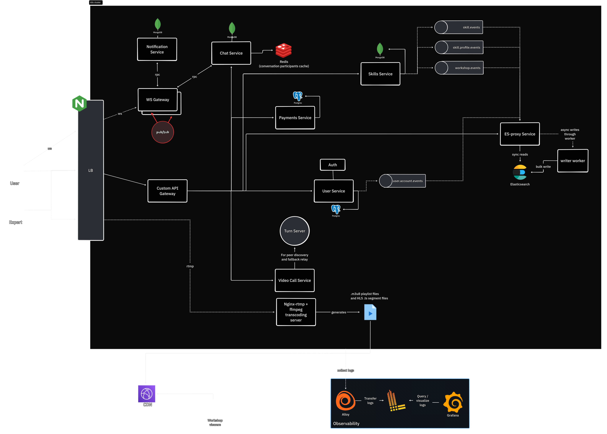
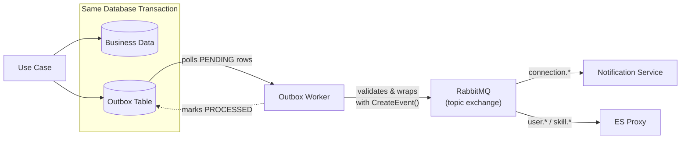

# 🍲 SkillStew API


> Event-driven microservices backend for SkillStew — a platform for discovering and attending live, expert-led workshops.

## Table of Contents

- [Overview](#overview)
- [Architecture](#architecture)
  - [Services](#services)
  - [Key Architectural Patterns](#key-architectural-patterns)
  - [Event Flow](#event-flow)
  - [Events](#events)
- [Tech Stack](#tech-stack)
- [Getting Started](#getting-started)
  - [Prerequisites](#prerequisites)
  - [Infrastructure Setup](#infrastructure-setup)
  - [Running Services](#running-services)
- [Project Structure](#project-structure)
- [Deployment & Infrastructure](#deployment--infrastructure)
- [Lessons Learned](#lessons-learned)
- [Roadmap](#roadmap)
- [License](#license)

## Overview

SkillStew is a platform for discovering and attending live, expert-led workshops. Unlike pre-recorded courses, SkillStew focuses on live sessions and community-driven learning to drive higher engagement and completion. Users can also exchange skills with each other for free through peer-to-peer skill exchanges.

This repository contains the backend — a microservices system that I am building as a deliberate exercise in distributed systems design. The frontend is being developed in parallel using React in a [separate repository](https://github.com/Faheem-T/skill-stew-client).

### What's Built

- User authentication (registration, login, JWT access + refresh tokens)
- User profiles and onboarding (username, location, languages, wanted/offered skills)
- User connections (request, accept, reject)
- Real-time notifications via WebSocket
- User search and recommendations via Elasticsearch
- Admin user management

### What's Planned

- Workshop creation and scheduling
- Cohort enrollment and live session streaming
- Session recordings and playback
- Peer-to-peer skill exchange scheduling
- Expert application and verification flow
- Payment processing and revenue management

## Architecture



### Services

| Service              | Responsibility                                                                                                        | Runtime        | Database           | README |
| -------------------- | --------------------------------------------------------------------------------------------------------------------- | -------------- | ------------------ | ------ |
| User service         | Auth, profiles, connections                                                                                           | Node.js (tsx)  | PostgreSQL         | -      |
| Skill service        | Skill taxonomy, user skill profiles                                                                                   | Bun            | MongoDB            | -      |
| Notification service | Notification persistence, real-time WebSocket delivery, unread notification count                                     | Bun            | MongoDB            | -      |
| ES Proxy service     | Proxy between clients and Elasticsearch, read replica for user profiles and skill taxonomy, search, recommended users | Node.js (tsx)  | -                  | -      |
| Payments service     | Payments (TODO)                                                                                                       | Node.js (tsx)  | -                  | -      |
| API Gateway          | JWT authentication, request routing, role-based access control                                                        | Node.js (tsx)  | -                  | -      |
| WebSocket Gateway    | Handles client WebSocket connections                                                                                  | Bun            | -                  | -      |
| Outbox workers       | Polls respective outbox tables / collections and publishes to RabbitMQ                                                | Bun / Node.js  | Depends on service | -      |
| Common package       | App event names, payload, and schemas (shared npm package)                                                            | -              | -                  | -      |

### Key Architectural Patterns

- **Clean Architecture:** Layered architecture with domain, application, infrastructure, and presentation layers enforcing a strict dependency rule — inner layers never depend on outer layers.
- **Transactional Outbox Pattern:** Events are written to an outbox table in the same database transaction as the business data, ensuring at-least-once delivery without dual-write risks. Outbox workers poll and publish to RabbitMQ.
- **Event-Driven Architecture (RabbitMQ topic exchange):** Cross-service side effects that do not need to happen in real time are achieved through events published to a durable topic exchange, enabling eventual consistency and loose coupling between services.
- **CQRS-lite with Elasticsearch:** Data that needs to be searched is replicated into Elasticsearch through events. The ES Proxy service exposes search APIs to query Elasticsearch, separating the read path from the write path.
- **Cross-Pod Real-Time Communication:** The WebSocket Gateway uses `@socket.io/redis-adapter` to sync Socket.io state across Kubernetes pods. The Notification service uses `@socket.io/redis-emitter` to push events to connected clients without running its own Socket.io server — both connect to the same Redis instance.
- **Domain-Driven Design principles:** Services are organized around bounded contexts with clearly defined domain entities, repository interfaces, and use cases. Business logic lives in the domain layer, isolated from infrastructure and framework concerns.

### Event Flow



### Events

These are the events currently in the system.

| Event name             | Producer      | Consumers              |
| ---------------------- | ------------- | ---------------------- |
| `user.registered`      | User service  | ES Proxy               |
| `user.verified`        | User service  | ES Proxy               |
| `user.profileUpdated`  | User service  | ES Proxy               |
| `skill.created`        | Skill service | ES Proxy               |
| `skill.updated`        | Skill service | ES Proxy               |
| `skill.deleted`        | Skill service | ES Proxy               |
| `skill.profileUpdated` | Skill service | ES Proxy, User service |
| `connection.requested` | User service  | Notification service   |
| `connection.accepted`  | User service  | Notification service   |
| `connection.rejected`  | User service  | Notification service   |

## Tech Stack

| Category               | Technologies                                                     |
| ---------------------- | ---------------------------------------------------------------- |
| Language               | TypeScript (strict mode)                                         |
| Service Runtimes       | Node.js (tsx), Bun                                               |
| API Framework          | Express.js                                                       |
| Databases              | PostgreSQL, MongoDB, Elasticsearch, Redis                        |
| ORMs                   | Drizzle ORM (PostgreSQL), Mongoose (MongoDB)                     |
| Validation             | Zod                                                              |
| Authentication         | JWT (access + refresh tokens, role-based signing keys via `kid`) |
| Event Broker           | RabbitMQ (amqplib, topic exchange)                               |
| Real-time              | Socket.io, `@socket.io/redis-adapter`, `@socket.io/redis-emitter` |
| Storage                | AWS S3                                                           |
| Orchestration          | Kubernetes (K3s), Skaffold, Docker                               |
| Observability          | Winston, Grafana Loki, Grafana Alloy, Prometheus                 |
| Secrets Management     | Infisical                                                        |
| Dev Tooling            | Husky, Commitlint (Conventional Commits), Jest                   |

## Getting Started

### Prerequisites

- Docker
- Kubernetes cluster ([Docker Desktop](https://docs.docker.com/desktop/), [Minikube](https://minikube.sigs.k8s.io/docs/start/), or [K3s](./infra/docs/k3s-setup-notes.md))
- [Skaffold](https://skaffold.dev/docs/install/#standalone-binary)

### 1. Provision Backing Services

All databases and message brokers run externally (not inside the cluster). Set up the following:

| Service       | Used By                          | Suggested Provider                                    |
| ------------- | -------------------------------- | ----------------------------------------------------- |
| PostgreSQL    | User service, Payments service   | [Aiven](https://aiven.io/)                            |
| MongoDB       | Skill service, Notification service | [MongoDB Atlas](https://www.mongodb.com/atlas)     |
| RabbitMQ      | All event producers / consumers  | [CloudAMQP](https://www.cloudamqp.com/)               |
| Redis         | WebSocket Gateway, Notification service | [CloudAMQP](https://www.cloudamqp.com/)         |

**Elasticsearch** runs inside the cluster. Apply the self-managed manifest:

```bash
kubectl apply -f infra/self-managed/es-depl.yaml
```

> **Note:** Elasticsearch requires ~500MB+ of RAM.

### 2. Configure Secrets (Infisical)

All services pull their environment variables from [Infisical](https://infisical.com/) at startup via `docker-entrypoint.sh` scripts.

1. Create an Infisical account and project.
2. Create the Kubernetes secret for Infisical credentials:

   `infra/k8s/infisical.secrets.yaml`

   ```yaml
   apiVersion: v1
   kind: Secret
   metadata:
     name: infisical-secrets
   type: Opaque
   stringData:
     INFISICAL_CLIENT_SECRET: "..."
     INFISICAL_CLIENT_ID: "..."
     INFISICAL_PROJECT_ID: "..."
   ```

3. Add the connection URLs and environment variables for each service in their respective Infisical folders. The folder name each service expects is defined as `INFISICAL_PATH` in its startup script (see [User service entrypoint](user/scripts/docker-entrypoint.sh) for an example).

### 3. Start Services

Once backing services are up and secrets are configured:

```bash
skaffold dev
```

Services are resilient to startup order — Skaffold brings everything up in parallel. All databases and Elasticsearch must be reachable before the services become healthy.

### 4. Seed Data (Optional)

To seed the skill taxonomy:

```bash
cd skill && npm run seed
```

## Project Structure

```
skill-stew-api/
├── common/                        # @skillstew/common — shared npm package
│   └── src/
│       ├── events/                # Event names, schemas, payload types, CreateEvent()
│       ├── types/                 # Shared TypeScript types
│       └── constants/             # Shared constants
├── user/                          # User service
├── skill/                         # Skill service
├── payments/                      # Payments service
├── gateway/                       # API Gateway
├── es-proxy/                      # Elasticsearch Proxy service
├── websocket-gateway/             # WebSocket Gateway
├── notification-service/          # Notification service
├── outbox-workers/
│   └── user-outbox-worker/        # User service outbox worker
├── infra/
│   ├── k8s/                       # Kubernetes deployment manifests
│   ├── self-managed/              # Self-hosted infra (Elasticsearch, etc.)
│   ├── prometheus/                # Prometheus config
│   ├── loki/                      # Loki config
│   ├── alloy/                     # Grafana Alloy config
│   └── docs/                      # Infrastructure setup notes
└── skaffold.yaml                  # Skaffold dev workflow config
```

Each service follows **Clean Architecture** internally:

```
service/src/
├── domain/                        # Business logic (entities, repository interfaces, errors)
├── application/                   # Use cases, DTOs, application errors
├── infrastructure/                # DB schemas, repository implementations, external services, mappers
├── presentation/                  # Controllers, routers, middlewares, error handlers
├── di/                            # Dependency injection container
├── utils/                         # Service-level utilities (logger, config, etc.)
├── types/                         # TypeScript type definitions
└── constants/                     # Service constants
```

## Deployment & Infrastructure

Each service has its own `Dockerfile` and is deployed as a separate Kubernetes Deployment. The full set of manifests lives in [`infra/k8s/`](infra/k8s/).

- **Ingress:** All external HTTP traffic is routed through a Kubernetes Ingress to the API Gateway, which handles authentication and forwards requests to internal services.
- **Dev workflow:** [Skaffold](https://skaffold.dev/) watches for source changes and hot-syncs TypeScript files into running pods, enabling rapid iteration without full rebuilds.
- **Secrets:** Services pull environment variables from [Infisical](https://infisical.com/) at container startup via `docker-entrypoint.sh` scripts.
- **Observability (planned):** Configuration for Prometheus, Grafana Loki, and Grafana Alloy is present in [`infra/`](infra/) but not yet wired up.

## Lessons Learned

- [Clean Architecture](docs/clean-architecture.md) — Why I chose layered architecture and how the dependency rule is enforced
- [Transactional Outbox](docs/transactional-outbox.md) — Solving the dual-write problem for reliable event delivery
- [Unit of Work Pattern](docs/unit-of-work-pattern.md) — Atomic multi-table writes across Drizzle (PostgreSQL) and Mongoose (MongoDB)
- [Connection Logic](docs/connection-logic.md) — Designing the user connection state machine
- [Notification Ordering](docs/notification-ordering.md) — Approaches to maintaining message ordering in distributed systems
- [Error Handling](docs/error-handling.md) — Three-layer error hierarchy across domain, application, and presentation

## Roadmap

### Features

- [ ] Workshop creation and scheduling
- [ ] Cohort enrollment and live session streaming
- [ ] Session recordings and playback
- [ ] Peer-to-peer skill exchange scheduling
- [ ] Expert application and verification flow
- [ ] Payment processing and revenue management

### Infrastructure

- [ ] Wire up observability stack (Prometheus, Grafana Loki, Grafana Alloy)
- [ ] CI/CD pipeline with GitHub Actions
- [ ] Unit, integration, and E2E tests
- [ ] Rate limiting at the API Gateway

## License

This project is licensed under the [MIT License](LICENSE).
